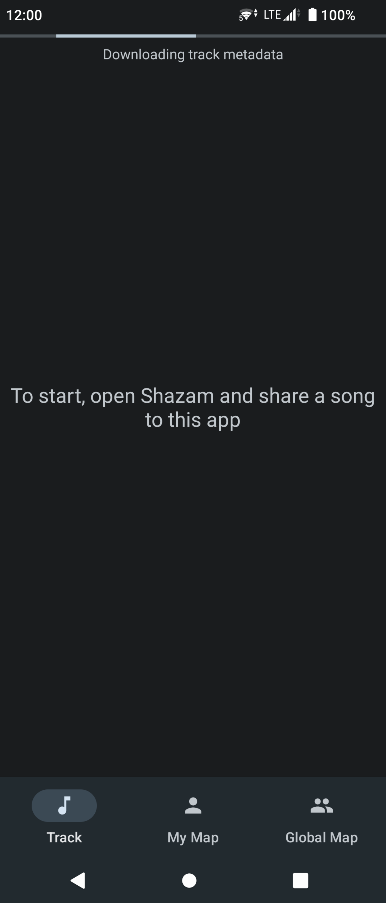

# Music Map

Connect your music to the places where you discovered it. Identify a song, then share it to this
application and add it to your own Music Map.

Future feature: Global map which will contain songs shared by all users. Allows you to find new
music (possibly filtered by genre or date of discovery) in new places.

### Screenshots

After the user shares the link to a track the application will start downloading its metadata

Once this finishes the results will be shown and the app will try to get the user location. If there
are any issues related to location services and/or their permissions, the following will appear. The
user could fix these issues and try again or pick a location manually.

Manual location picker  
The user could drag the marker to their current location

If location services work the app will try to automatically determine the user's location.  
If the accuracy is not good enough, the user could pick the location manually.

Once the app gets a precise location, the user can add the result to their map.  
They could still tap on the manual location button to verify its correctness and improve it if
needed.

By navigating to the "My Map" fragment, the user could see all their tracks in the places that they
were identified.

When a user taps a map marker, a pop up information window appears with the song's metadata,
including its album art. If they switch to the "Track" fragment through the bottom navigation bar,
they could see more details about the last track they tapped on the map.
